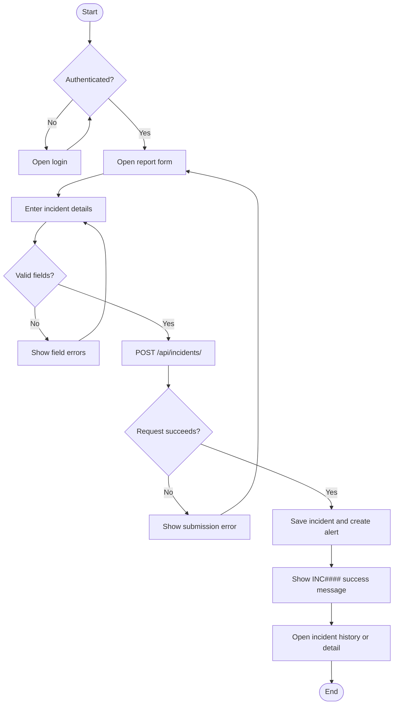
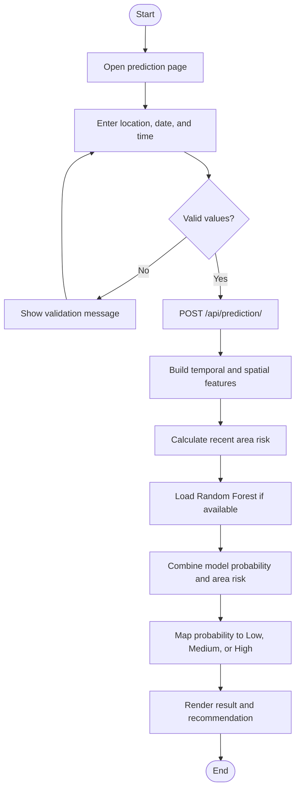
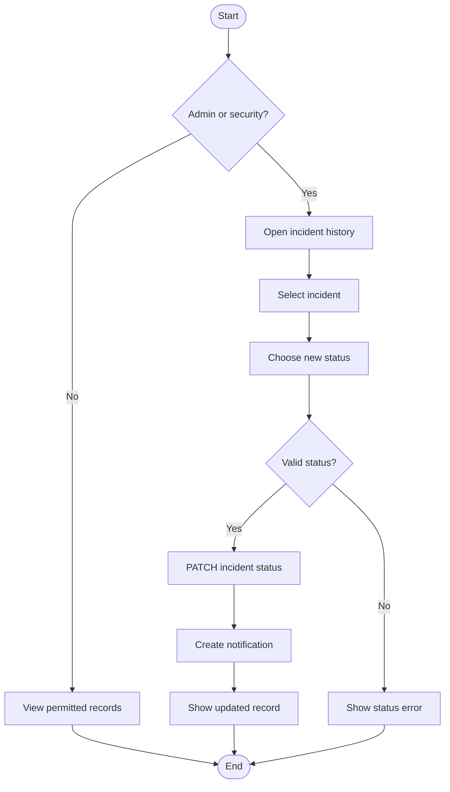
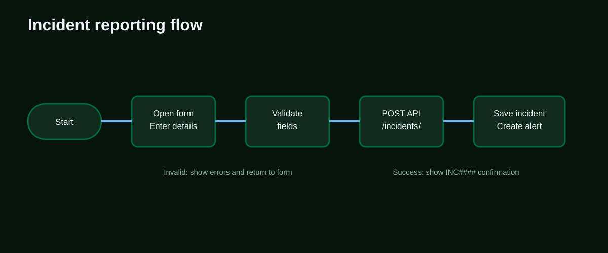

# CampusShield AI Activity Flows

## Incident Reporting Activity

```mermaid
flowchart TD
    Start([Start]) --> Auth{Authenticated?}
    Auth -- No --> Login[Open login]
    Login --> Auth
    Auth -- Yes --> Form[Open report form]
    Form --> Input[Enter incident details]
    Input --> Validate{Valid fields?}
    Validate -- No --> Errors[Show field errors]
    Errors --> Input
    Validate -- Yes --> Submit[POST /api/incidents/]
    Submit --> Server{Request succeeds?}
    Server -- No --> Failure[Show submission error]
    Failure --> Form
    Server -- Yes --> Saved[Save incident and create alert]
    Saved --> Success[Show INC#### success message]
    Success --> History[Open incident history or detail]
    History --> End([End])
```

## AI Prediction Activity

```mermaid
flowchart TD
    Start([Start]) --> Form[Open prediction page]
    Form --> Values[Enter location, date, and time]
    Values --> Validate{Valid values?}
    Validate -- No --> Error[Show validation message]
    Error --> Values
    Validate -- Yes --> Request[POST /api/prediction/]
    Request --> Service[Build temporal and spatial features]
    Service --> Area[Calculate recent area risk]
    Area --> Model[Load Random Forest if available]
    Model --> Combine[Combine model probability and area risk]
    Combine --> Level[Map probability to Low, Medium, or High]
    Level --> Result[Render result and recommendation]
    Result --> End([End])
```

## Incident Review Activity

```mermaid
flowchart TD
    Start([Start]) --> Staff{Admin or security?}
    Staff -- No --> ReadOnly[View permitted records]
    Staff -- Yes --> List[Open incident history]
    List --> Select[Select incident]
    Select --> Status[Choose new status]
    Status --> Valid{Valid status?}
    Valid -- No --> Message[Show status error]
    Valid -- Yes --> Patch[PATCH incident status]
    Patch --> Notify[Create notification]
    Notify --> Updated[Show updated record]
    ReadOnly --> End([End])
    Updated --> End
    Message --> End
```

## Presentation Image

