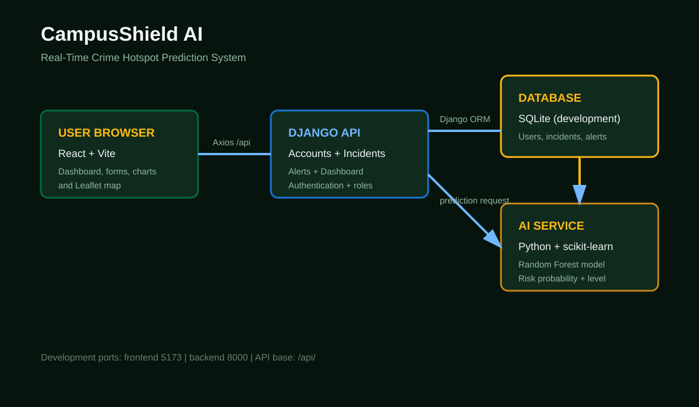

# CampusShield AI System Architecture

## Context

CampusShield AI is a React and Django web application with a Python machine-learning pipeline. The browser communicates with the backend through JSON API requests. The backend owns authentication, authorisation, persistence, incident workflows, alerts, and prediction orchestration.

## Component Diagram

```mermaid
flowchart LR
    Browser[User browser\nReact + Vite]
    API[Django API\nAccounts | Incidents | Alerts | Dashboard]
    Auth[Token authentication\nrole checks]
    DB[(SQLite development DB\nUsers | Profiles | Incidents | Alerts)]
    Predict[Prediction service\nPython]
    Model[(Random Forest\ncrime_prediction.pkl)]
    Data[(CSV datasets\ncrime | locations | weather | holidays)]
    Map[Leaflet map\nKNUST locations]

    Browser -->|Axios JSON /api| API
    Browser --> Map
    API --> Auth
    API --> DB
    API --> Predict
    Predict --> Model
    Predict --> DB
    Data --> Model
```

## Runtime Responsibilities

| Component | Responsibility |
|---|---|
| React frontend | Routing, forms, tables, charts, map, role-aware navigation |
| Django API | Request handling, validation, authentication, permissions, business actions |
| SQLite database | Development persistence for users, profiles, incidents, alerts, notifications |
| Prediction service | Builds features, combines recent area risk with model probability, returns risk level |
| Trained model | Estimates high-risk probability from time and location features |
| Leaflet | Displays campus coordinates, markers, and risk zones |

## Deployment Boundaries

- Development frontend: `http://localhost:5173`
- Development backend: `http://localhost:8000`
- API base path: `/api/`
- Production recommendation: deploy frontend and backend separately, use PostgreSQL, HTTPS, environment secrets, and a shared API URL.

## Main Data Flows

1. Authentication returns a token that the frontend stores for later API requests.
2. Incident reports are posted to Django and saved with the authenticated reporter.
3. A new incident can create an incident broadcast alert and notifications.
4. Incident history and dashboard pages retrieve records from the API.
5. Prediction requests combine submitted time/location values with recent incident risk and the saved model.
6. The frontend renders the returned risk result and map/dashboard summaries.

## Presentation Image



## Security Boundaries

- Protected routes require an authenticated frontend session.
- Backend views use authentication decorators before returning protected data.
- Admin and security roles may update incident status.
- Admin-only navigation exposes user management.
- Secrets, production database credentials, and API URLs belong in environment configuration.
