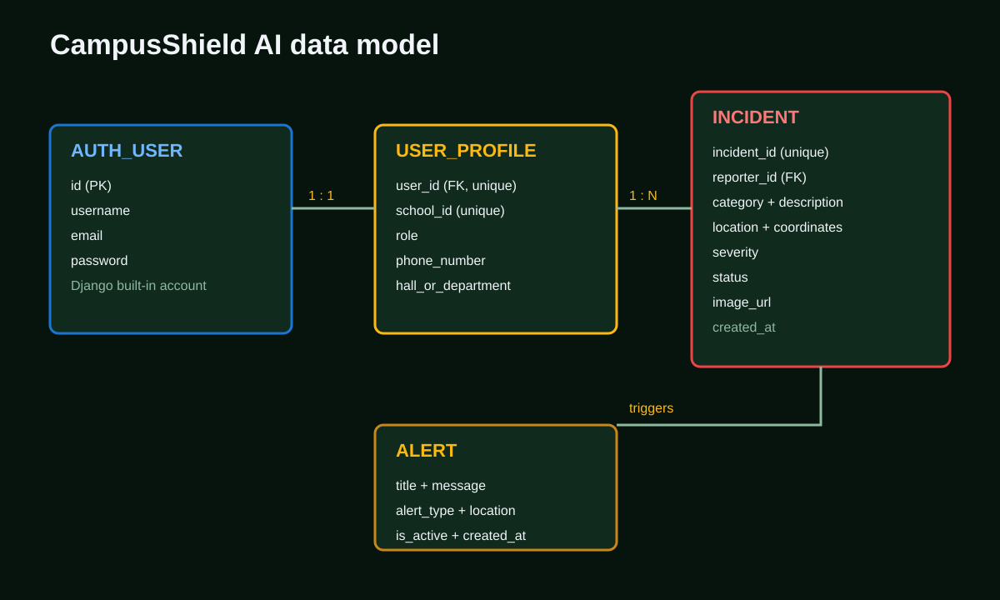

# CampusShield AI Entity Relationship Design

## Entity Relationship Diagram

```mermaid
erDiagram
    AUTH_USER ||--|| USER_PROFILE : has
    AUTH_USER ||--o{ INCIDENT : reports
    INCIDENT ||--o{ ALERT : triggers

    AUTH_USER {
        int id PK
        string username
        string password
        string email
        boolean is_active
    }
    USER_PROFILE {
        int id PK
        int user_id FK UK
        string school_id UK
        string role
        string phone_number
        string hall_or_department
        datetime created_at
        datetime updated_at
    }
    INCIDENT {
        int id PK
        string incident_id UK
        int reporter_id FK
        string category
        text description
        string location_name
        float latitude
        float longitude
        string severity
        string status
        string image_url
        datetime created_at
    }
    ALERT {
        int id PK
        string title
        text message
        string alert_type
        string location_name
        boolean is_active
        datetime created_at
    }
```

## Relationships

| Relationship | Cardinality | Meaning |
|---|---:|---|
| `AUTH_USER` to `USER_PROFILE` | 1:1 | Each account has one campus profile |
| `AUTH_USER` to `INCIDENT` | 1:N | One user may report many incidents |
| `INCIDENT` to `ALERT` | 1:N conceptually | A submitted incident may trigger a broadcast alert; alerts remain independently stored |

## Presentation Image



## Controlled Values

- User roles: `STUDENT`, `SECURITY`, `ADMIN`, `IT`
- Incident severity: `Low`, `Medium`, `High`, `Critical`
- Incident status: `Reported`, `Under Review`, `Verified`, `Resolved`, `Dismissed`
- Alert type: `HIGH_RISK_ZONE`, `INCIDENT_BROADCAST`, `SECURITY_DISPATCH`

## Integrity Rules

- `incident_id` is unique and human-readable, for example `INC0001`.
- `school_id` is unique for each profile.
- Deleting a user keeps the incident record but clears its reporter reference.
- Incident coordinates and location are required for useful map and prediction workflows.
- Alert and notification records are timestamped for chronological display.

The development database is SQLite. PostgreSQL is recommended for a shared production deployment.
