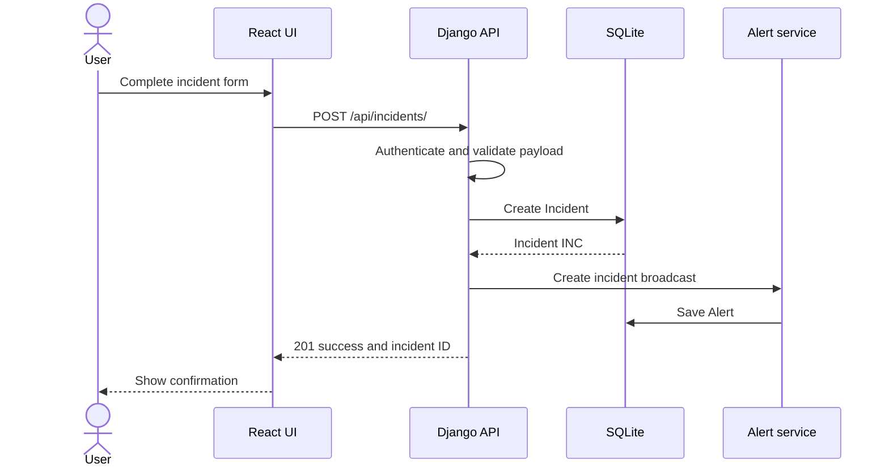
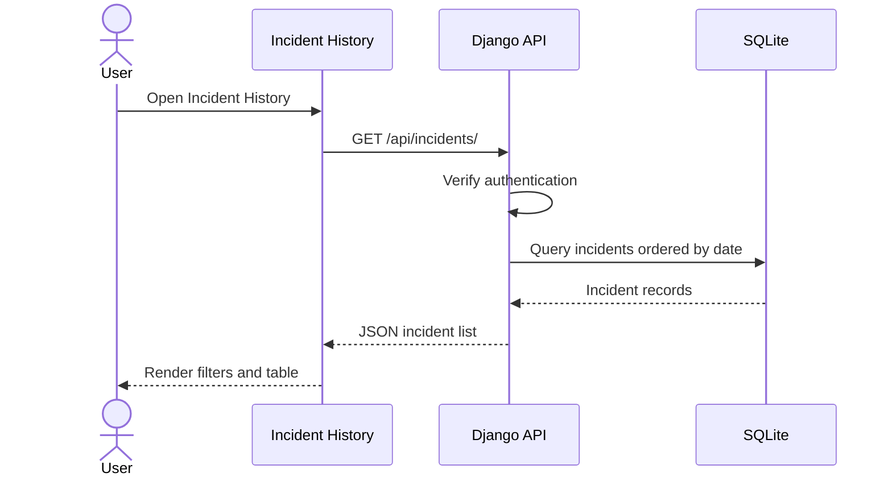
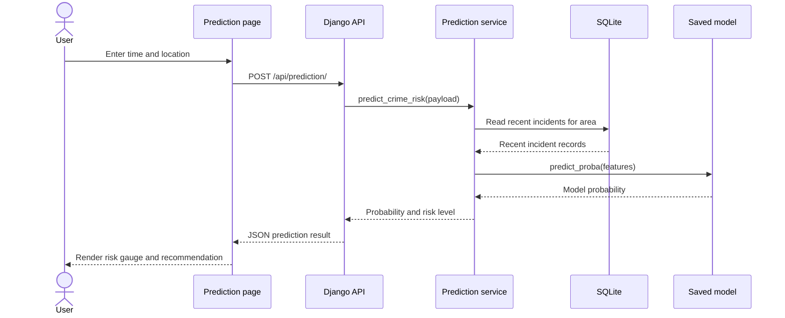
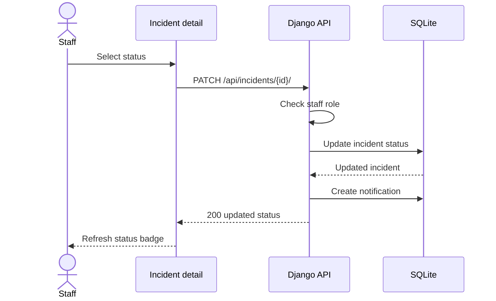
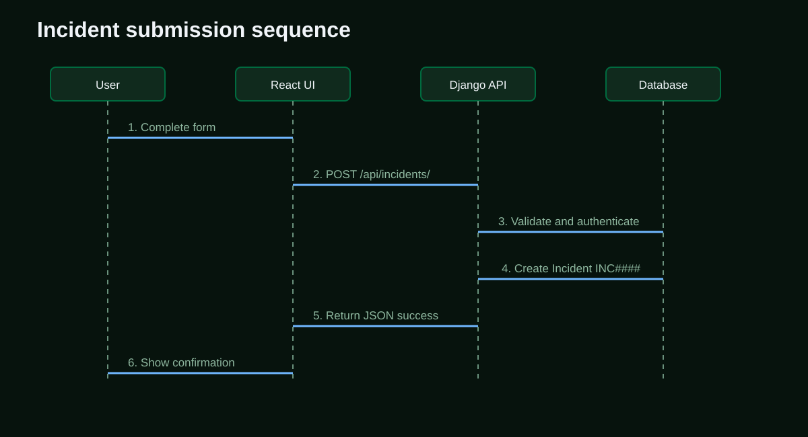

# CampusShield AI Sequence Diagrams

## Submit Incident

```mermaid
sequenceDiagram
    actor User
    participant UI as React UI
    participant API as Django API
    participant DB as SQLite
    participant Alerts as Alert service

    User->>UI: Complete incident form
    UI->>API: POST /api/incidents/
    API->>API: Authenticate and validate payload
    API->>DB: Create Incident
    DB-->>API: Incident INC####
    API->>Alerts: Create incident broadcast
    Alerts->>DB: Save Alert
    API-->>UI: 201 success and incident ID
    UI-->>User: Show confirmation
```

## Fetch Incident History

```mermaid
sequenceDiagram
    actor User
    participant UI as Incident History
    participant API as Django API
    participant DB as SQLite

    User->>UI: Open Incident History
    UI->>API: GET /api/incidents/
    API->>API: Verify authentication
    API->>DB: Query incidents ordered by date
    DB-->>API: Incident records
    API-->>UI: JSON incident list
    UI-->>User: Render filters and table
```

## Run Prediction

```mermaid
sequenceDiagram
    actor User
    participant UI as Prediction page
    participant API as Django API
    participant Risk as Prediction service
    participant DB as SQLite
    participant Model as Saved model

    User->>UI: Enter time and location
    UI->>API: POST /api/prediction/
    API->>Risk: predict_crime_risk(payload)
    Risk->>DB: Read recent incidents for area
    DB-->>Risk: Recent incident records
    Risk->>Model: predict_proba(features)
    Model-->>Risk: Model probability
    Risk-->>API: Probability and risk level
    API-->>UI: JSON prediction result
    UI-->>User: Render risk gauge and recommendation
```

## Update Incident Status

```mermaid
sequenceDiagram
    actor Staff
    participant UI as Incident detail
    participant API as Django API
    participant DB as SQLite

    Staff->>UI: Select status
    UI->>API: PATCH /api/incidents/{id}/
    API->>API: Check staff role
    API->>DB: Update incident status
    DB-->>API: Updated incident
    API->>DB: Create notification
    API-->>UI: 200 updated status
    UI-->>Staff: Refresh status badge
```

## Presentation Image

