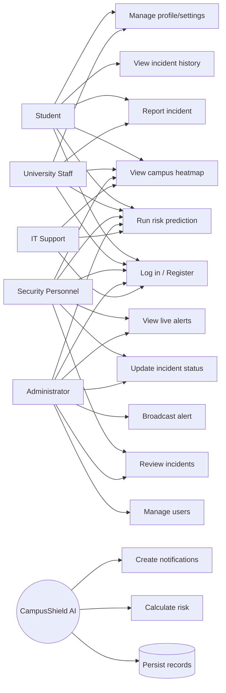
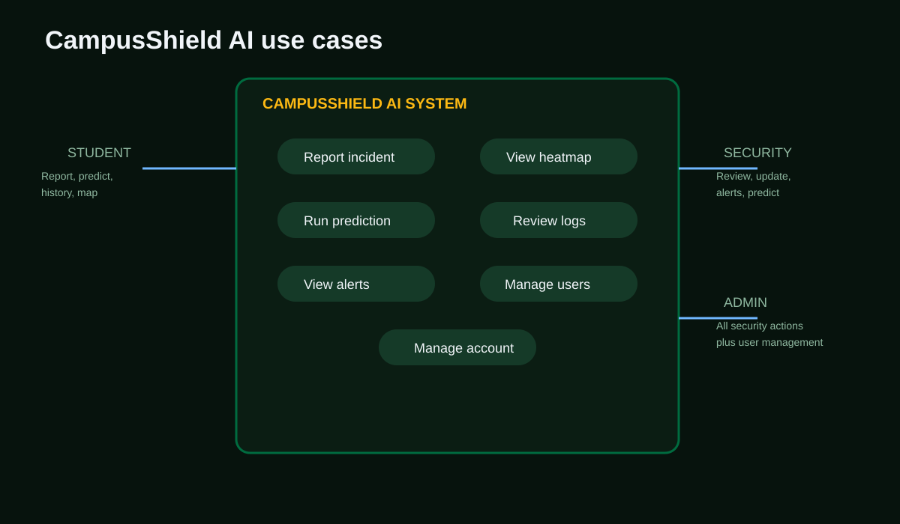

# CampusShield AI Use Case Design

## Actors

| Actor | Description |
|---|---|
| Student | Reports incidents, views personal incident history, checks predictions and account pages |
| University Staff | Reports incidents, views incident information, checks predictions and account pages |
| Security Personnel | Reviews incident records, updates statuses, monitors alerts, uses risk information |
| Administrator | Performs security actions plus manages users and system oversight |
| IT Support | Uses authenticated campus safety features and supports platform operations |
| System | Stores records, runs predictions, creates alerts, and sends notifications |

## Use Case Diagram

## Core Use Case Specifications

### Report incident

- Actor: Student, University Staff, Security Personnel, Administrator
- Preconditions: Actor is authenticated.
- Main flow: Enter category, severity, description, location, coordinates, and optional evidence; submit the form.
- Result: System creates a unique incident ID and stores the report as `Reported` for non-admin users.
- Exceptions: Missing/invalid fields or unavailable API returns an error state.

### Register account

- Actor: Student, University Staff, Security Personnel, Administrator, IT Support
- Main flow: Select an account type and provide name, ID, university email, and password.
- Student condition: Provide program of study.
- Staff condition: Provide title, occupation, and department where applicable; the optional other name is also stored.
- Result: The system creates a profile linked to the Django user account.

## Presentation Image

### Review and update incident

- Actor: Security Personnel or Administrator
- Preconditions: Actor is authenticated and has a staff role.
- Main flow: Open incident history, select a record, choose a new valid status, submit.
- Result: Incident status changes and a notification is created.
- Restriction: Students cannot update incident status.

### Run risk prediction

- Actor: Authenticated user
- Preconditions: Location, time, and date parameters are valid.
- Main flow: Submit prediction form; backend derives features and combines model and recent-area risk.
- Result: System returns probability, risk level, night indicator, and coordinates.

### Broadcast alert

- Actor: Administrator or authorised security user
- Preconditions: Actor is authenticated and alert details are valid.
- Main flow: Enter alert type, title, message, and location; submit.
- Result: Active alert is stored and appears in the alert feed.
