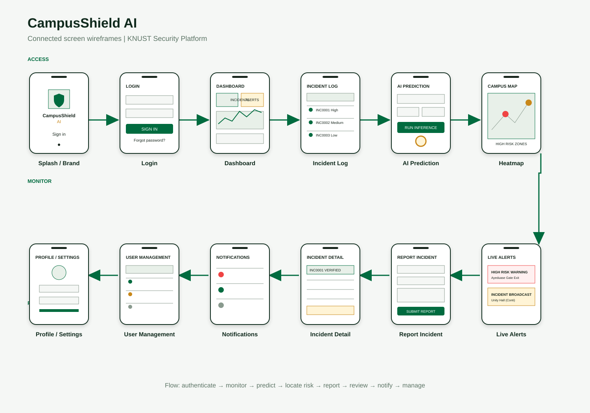

# CampusShield AI Visual Wireframe Gallery

These screenshots were captured from the running application on August 22, 2026 using the admin demo account. They show the current implementation at desktop width (1440 x 1000) and mobile width (390 x 844).

## Connected Wireframe Board

This is the visual storyboard requested for the presentation. It connects the screens in the order a user moves through the system:

[Open the connected wireframe image](campusshield-screen-flow-wireframe.svg)

## Authentication

| Screen | Desktop | Mobile / related state |
|---|---|---|
| Login | [Open image](screenshots/login-desktop.png) | [UI reference](../UI/login-page.png) |
| Register | [Open image](screenshots/register-desktop.png) | [UI reference](../UI/register-page.png) |
| Forgot password | [Open image](screenshots/forgot-password-desktop.png) | [UI reference](../UI/forgot-password-page.png) |
| Reset password | [Open image](screenshots/reset-password-desktop.png) | - |
| Not found / invalid route | [Open image](screenshots/not-found-desktop.png) | - |

## Main Application Pages

| Screen | Desktop | Mobile |
|---|---|---|
| Dashboard | [Open image](screenshots/dashboard-desktop.png) | [Open image](screenshots/dashboard-mobile.png) |
| Report incident | [Open image](screenshots/report-incident-desktop.png) | [Open image](screenshots/report-incident-mobile.png) |
| Incident history | [Open image](screenshots/incident-history-desktop.png) | [Open image](screenshots/incident-history-mobile.png) |
| Incident detail | [Open image](screenshots/incident-detail-desktop.png) | - |
| AI prediction | [Open image](screenshots/ai-prediction-desktop.png) | [Open image](screenshots/ai-prediction-mobile.png) |
| Crime heatmap | [Open image](screenshots/crime-heatmap-desktop.png) | [Open image](screenshots/crime-heatmap-mobile.png) |
| Live alerts | [Open image](screenshots/live-alerts-desktop.png) | [Open image](screenshots/live-alerts-mobile.png) |
| Notifications | [Open image](screenshots/notifications-desktop.png) | [Open image](screenshots/notifications-mobile.png) |
| User management | [Open image](screenshots/user-management-desktop.png) | [Open image](screenshots/user-management-mobile.png) |
| Profile | [Open image](screenshots/profile-desktop.png) | [Open image](screenshots/profile-mobile.png) |
| Settings | [Open image](screenshots/settings-desktop.png) | [Open image](screenshots/settings-mobile.png) |

## Behaviour States

| Behaviour | Screenshot |
|---|---|
| Dashboard incident modal | [Open image](screenshots/dashboard-incident-modal.png) |
| Mobile sidebar open | [Open image](screenshots/dashboard-mobile-sidebar-open.png) |
| Mobile prediction form | [Open image](screenshots/prediction-form-mobile.png) |
| Prediction result | [Open image](screenshots/prediction-result.png) |
| Settings toggle state | [Open image](screenshots/settings-toggle-state.png) |

## Capture Notes

- Desktop captures include the persistent sidebar, top navigation, page content, and footer.
- Mobile captures show responsive stacking and the compact navigation control.
- Map tiles may appear partially blank when external OpenStreetMap tiles are unavailable; the Leaflet map controls and risk overlay structure remain visible.
- The screenshots document the current UI; replace them after major frontend changes.
